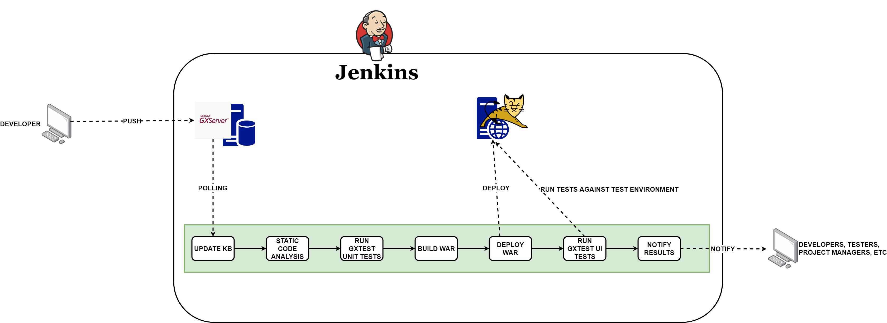

# Basic GeneXus CI/CD pipeline

Inside this repo you will find an example on how to set up a CI/CD pipeline using GeneXus.

## Environment

The environment used for this demo consists on two Windows Server 2019 instances hosted on AWS. One of them is the GXServer and the other one is hosting both a Jenkins instance and a local Tomcat installation which is used as the QA environment to deploy to.

## Flow

The pipeline's flow looks like this:

The setup is as follows:

+ One *freestyle job* to poll the GXServer for changes, which will update the local copy of the KB if there are any. It triggers a pipeline execution as a *post build action*.

+ One pipeline which carries out the following tasks in order:
    + Static code analysis using KBDoctor.
    + Builds the KB and executes GXTest Unit Tests using an MSBuild task.
    + Builds the WAR using an MSBuild task.
    + Deploys the WAR to a local *Tomcat* using an inline *Powershell* script.
    + Executes GXTest UI Tests using an MSBuild task.
    + Notifies the results via email to the interested parts.

The MSBuild tasks used are available inside the scripts folder, as well as a batch script used to build the WAR and a sample KBDoctor config file which is the one used inside the pipeline.